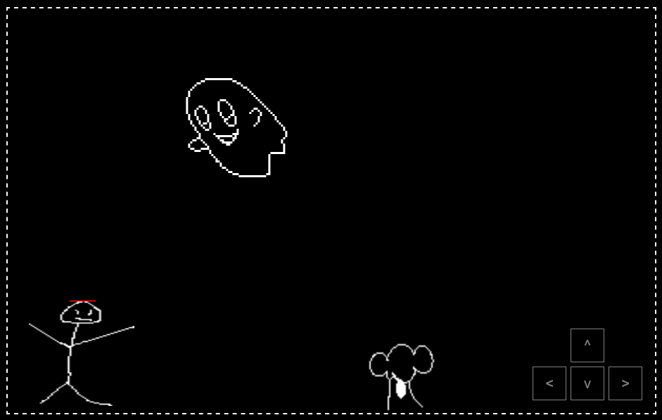

# boo — js ghost mini-game

float around and scare people by landing on their heads and inputting the correct key combo. 
correct input advances the level.
dont run into the side of someone or you'll blow away! 

## play
pull the source, navigate to the repo, run a server `python -m http.server 8000`, then open `http://localhost:8000` to test (or wait until i host it!). control boo with arrow keys [<, >, ^, v].